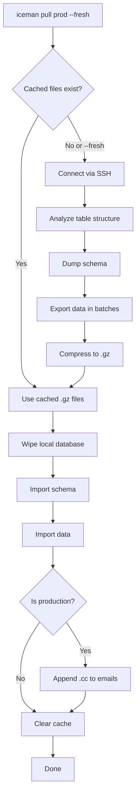
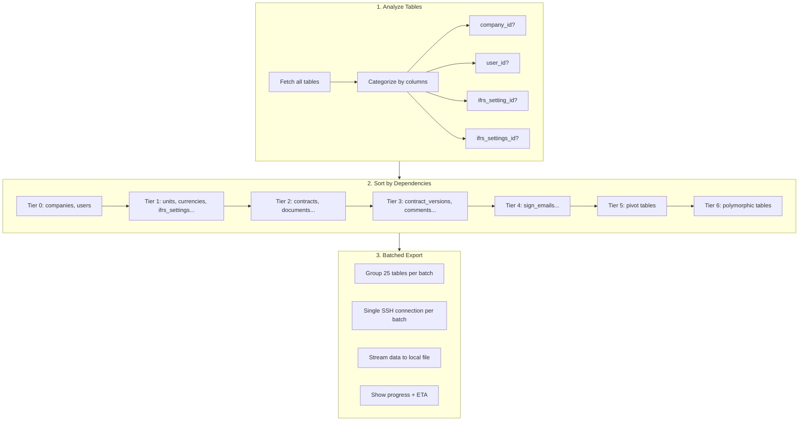
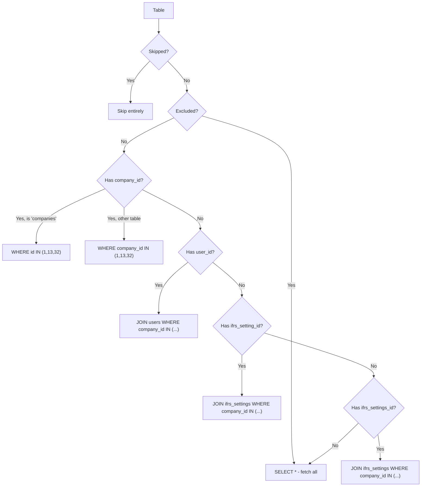

# ICEMAN

Internal tool for Leasify for deployment and pipeline.

## Commands

| Command | Description |
|---------|-------------|
| `iceman env` | Check/read your environment settings |
| `iceman pull {env}` | Pull database from remote environment to local |
| `iceman pull:sail {env}` | Pull database to Laravel Sail environment |
| `iceman feature {branch}` | Create a new Laravel Forge site in AWS |
| `iceman db:update {env}` | Update a dev environment database from prod |

## Pull Command

The `pull` command fetches a filtered subset of the production database to your local environment.

### Usage

```bash
# Basic usage (uses cached files if available)
iceman pull prod

# Force fresh database dump
iceman pull prod --fresh

# Include extra companies (adds to default 1,13,32)
iceman pull prod --fresh --company=45,67
```

### How It Works



### Selective Export Process

The export filters data by company to reduce database size. Default companies: **1, 13, 32**.



### Filtering Logic



### Table Categories

#### Skipped Tables (not exported - too large/unnecessary)

```php
$skippedTables = [
    'activity_log',        // ~2.8M rows
    'action_events',
    'notifications',
    'contract_version_report',  // ~1.2M rows
    'contract_balances',
];
```

#### Excluded Tables (exported in full, no filtering)

```php
$excludedTables = [
    'migrations',
    'password_resets',
    'password_reset_tokens',
    'failed_jobs',
    'sessions',
    'cache',
    'cache_locks',
    'jobs',
    'job_batches',
    'personal_access_tokens',
    'help_texts',
    'guides',
    'languages',
];
```

Tables starting with `telescope_` are also excluded automatically.

### Configuration

To modify table handling, edit `app/Helpers/SelectiveDatabaseExport.php`:

- Add to `$skippedTables` to completely skip a table
- Add to `$excludedTables` to fetch all rows without filtering

## Other Commands

* `db:update {environment}` eg, `iceman db:update dev3` gets the database from the production environment and updates dev3 database.

## FORGE API
Please ensure that the env key FORGE_API is set, eg:
`export FORGE_API=eyJ0eXAiOiJK`

## Upgrades

**Important:** Build the phar BEFORE tagging. The version comes from the build, not the git tag.

```bash
# 1. Build with version number
php iceman app:build iceman --build-version=X.Y.Z

# 2. Commit the built phar
git add builds/iceman
git commit -m 'X.Y.Z release'

# 3. Tag and push
git tag X.Y.Z
git push origin main --tags
```

Users update with: `composer global update leasify/iceman`

## Cloudnet
You need to have your SSH-key installed at Cloudnet servers. Please contact them at support@cloudnet.se to get access for your local environment.

## License
Iceman is an open-source software licensed under the MIT license.
